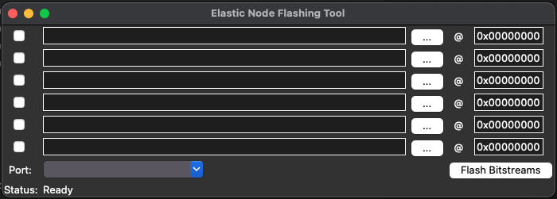
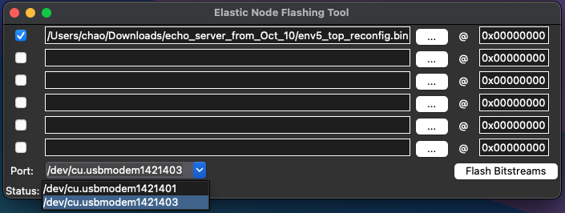
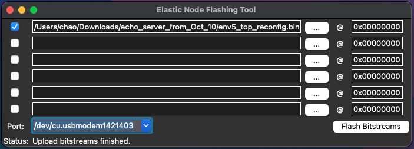

# ElasticNodeBitstreamFlasher
A gui tool to upload bitstream to elastic node.

# Dependencies
- Python 3.11.6 (lower or higher versions may work)
- pyserial
- python-tk

**Note**: tkinter is included with Python for Windows. On Linux, you can install it with `sudo apt install python3-tk`, on Mac OS X, you can install it with `brew install python-tk`.

# Usage
1. Install dependencies, for example on Ubuntu:
``` bash
pip install serial
sudo apt install python3-tk
```
2. Upload the prebuild firmware to your elastic node.
    - keep pressing MCU boot button on the elastic node and then click the reset button, then release the MCU boot button. This will put the elastic node into the bootloader mode.
    - copy the prebuild firmware to the elastic node, 
        - for example on Ubuntu:
        ``` bash
        cp firmwares/firmware_env5_rev2_iap.uf2 /media/$USER/RPI-RP2
        ```
        - Alternatively, you can find a usb drive named `RPI-RP2` (can be slightly different) in your file manager, and copy the firmware to it.
    - wait for the elastic node to reboot.
    - check if you have two serial devices on your computer, 
        - for example on Ubuntu:
        ``` bash
            ls /dev/ttyACM*
        ```
        - on MAC OS X:
        ``` bash
            ls /dev/cu.usbmodem*
        ```
            
        what I got on my Mac is:

        ``` bash
        ls /dev/cu.usbmodem*
        /dev/cu.usbmodem1421401 /dev/cu.usbmodem1421403
        ```
        The device with the smaller number is the serial device for the debug messages you don't need it normally, and the other one `/dev/cu.usbmodem1421403` is for the bitstream uploading. 

3. Run the python script:
    ``` bash
    python3 iap.py
    ```
    Then you should see the gui window.
    

4. Select bitfile with the button `...`, at the moment you can select up to 6 bitfiles at once and you should cafully change the address of where to store this files to avoid overlapping. The python script will check if there is an overlap and skip the later file that overlaps with the previous one.

5. You can also select more than one file, but only enable 1 checkbox. The python script will only upload the bitstream with the enabled checkbox. This is quite useful when you want to upload different bitstreams for a series of experiments.

6. Select the serial port, every time you click the slect box it will refresh the serial port list. in my case I will select `/dev/cu.usbmodem1421403`.


7. After all is set, click the `Flash Bitstream` button, the python script will upload the bitstream to the elastic node. You can see the status update at the bottom of the gui window. Figure below has a mesaage saying the bitstream is uploaded successfully.


8. Now bitfile is uploaded, you can upload you application image to the pico mcu.